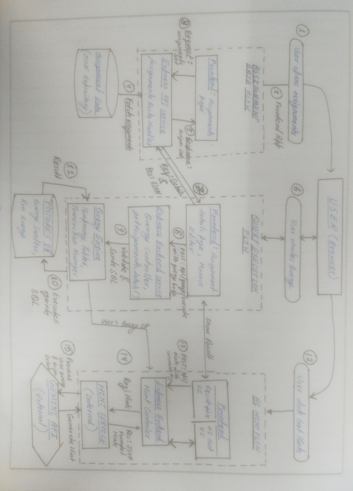

# CipherSQLStudio

A full-stack SQL practice platform where learners select assignments, run SQL against sandboxed data, and request AI hints without receiving direct answers.

## My Project Strong-Holds

- Real learning workflow: assignment selection -> SQL execution -> feedback loop.
- Safe SQL runtime: user queries execute inside transaction-scoped temporary tables, then roll back.
- Structured hint system: Gemini-powered conceptual hints plus guided questions.
- Responsive UI: assignment browsing and query execution flow work across desktop and mobile.

## Project Highlights

- Frontend: Next.js 16 + React 19 + Monaco Editor for SQL authoring.
- Backend: Express 5, PostgreSQL (query execution), MongoDB connection layer, and modular service architecture.
- Data source: assignment dataset from `data/CipherSqlStudio-assignment.json`.
- Current dataset size: 4 assignments.

## Repository Structure

```text
cipher_sql_engine/
|-- client/                        # Next.js frontend
|   |-- src/app/assignments/       # Assignment list 
|   |                |-- [id]/     # attempt pages
|   |-- src/components/            # Editor, result panel, cards, tables
|   |-- src/lib/api.ts             # Centralized API layer
|   `-- .env.example               # Frontend env template
|-- server/                        # Express backend
|   |-- src/routes/                # assignments/query/hints routes
|   |-- src/controllers/           # Request handlers
|   |-- src/services/              # Query sandbox + hint generation
|   |-- src/repositories/          # Assignment data access
|   |-- src/config/                # Postgres + MongoDB connections
|   `-- .env.example               # Backend env template
|-- data/
|   `-- CipherSqlStudio-assignment.json
|-- docs/                          # Architecture/flow documentation area
`-- README.md
```

## Tech Stack And Rationale

| Layer               | Choice                             | Why This Choice                                                              |
| ------------------- | ---------------------------------- | ---------------------------------------------------------------------------- |
| Frontend framework  | Next.js (App Router)               | Fast routing, server/client rendering flexibility, production-ready DX       |
| UI runtime          | React 19                           | Component-driven UI and predictable state management                         |
| SQL editor          | Monaco (`@monaco-editor/react`)  | IDE-like SQL editing experience                                              |
| Backend framework   | Express 5                          | Lightweight, modular routing and controller/service separation               |
| SQL execution       | PostgreSQL (`pg`)                | Reliable SQL engine and strong transactional behavior                        |
| AI hints            | Gemini (`@google/generative-ai`) | Low-latency hint generation with structured mentoring output                 |
| Additional DB layer | MongoDB (`mongoose`)             | Prepared for persistence extensions (attempt logs, user progress, analytics) |


## Architecture & Data Flow

CipherSQLStudio is built on a modular three-tier architecture that separates user interaction, business logic, and secure database execution.



### 1. Assignment Data Flow
This flow handles the initial discovery phase when a user explores the platform.
* **Trigger:** User opens the assignments page in the Browser.
* **Process:** The Next.js frontend sends a request to the `Express API Service`.
* **Data Retrieval:** The `Assignments Route Handler` fetches the structured assignment metadata from the **JSON Repository** (JSON-based storage for quick read access).
* **Result:** A list of available SQL challenges is returned to the UI for selection.

### 2. Query Execution Flow (The Sandbox)
This is the core engine where user-written SQL is safely validated and executed.
* **Input:** The user writes a SQL query in the **Monaco Editor** and submits it.
* **Middleware:** The request hits the `Express Backend Service`. The **Query Controller** validates the request body and passes the raw SQL to the **Query Engine**.
* **Execution:** To prevent permanent data mutation, the engine manages a **Transaction Manager**. It creates **Temporary Tables** within a session, executes the user's SQL, and then rolls back the transaction.
* **Output:** The execution results (or errors) are sent back and rendered in the **Result Table UI**.

### 3. AI Hint Flow
Instead of providing direct answers, this flow focuses on guided learning using the Gemini API.
* **Trigger:** When a user is stuck, they click "Get Hints" in the UI.
* **Logic:** The frontend sends the current `query` and `assignmentId` to the **Hint Controller**.
* **Processing:** The internal **Hint Service** aggregates the user's attempt and the assignment context. It communicates with the **Gemini API (External)** to generate a conceptual guide.
* **Result:** The AI response is processed and delivered as **Formatted Hints** in the AI Hint UI, guiding the user toward the solution without revealing the code.


## End-To-End Setup

### 1. Prerequisites

- Node.js 20+
- npm 10+
- PostgreSQL running locally or remotely
- MongoDB running locally or remotely
- Gemini API key

### 2. Clone and enter project

```bash
git clone https://github.com/namanSR-dev/cipherSQLstudio.git
cd cipher_sql_engine
```

### 3. Install dependencies

```bash
cd server
npm install

cd ../client
npm install
```

### 4. Configure environment variables

Create local env files from examples.

#### Backend (`server/.env`)

```bash
cp .env.example .env
```

PowerShell alternative:

```powershell
Copy-Item .env.example .env
```

| Variable           | Required | Purpose                      |
| ------------------ | -------- | ---------------------------- |
| `PORT`           | Yes      | Express server port          |
| `POSTGRES_URL`   | Yes      | PostgreSQL connection string |
| `MONGO_URI`      | Yes      | MongoDB connection string    |
| `GEMINI_API_KEY` | Yes      | Gemini API access for hints  |

#### Frontend (`client/.env.local`)

```bash
cp .env.example .env.local
```

PowerShell alternative:

```powershell
Copy-Item .env.example .env.local
```

| Variable                 | Required | Purpose                                              |
| ------------------------ | -------- | ---------------------------------------------------- |
| `NEXT_PUBLIC_API_BASE` | Yes      | Backend base URL (example:`http://localhost:5000`) |

### 5. Run backend

```bash
cd server
npm run dev
```

Backend default URL: `http://localhost:5000`

### 6. Run frontend

```bash
cd client
npm run dev
```

Frontend default URL: `http://localhost:3000`

## API Summary

| Method   | Endpoint             | Description                        |
| -------- | -------------------- | ---------------------------------- |
| `GET`  | `/`                | Health route                       |
| `GET`  | `/assignments`     | Fetch assignment summaries         |
| `GET`  | `/assignments/:id` | Fetch assignment detail            |
| `POST` | `/query/execute`   | Execute user SQL in sandbox        |
| `POST` | `/hints`           | Generate AI hint for current query |

### Example request payloads

```json
POST /query/execute
{
  "assignmentId": "1",
  "query": "SELECT * FROM employees;"
}
```

```json
POST /hints
{
  "assignmentId": "1",
  "query": "SELECT name FROM employees WHERE salary > 50000"
}
```

## Future Improvements

- Persist submission history and attempts in MongoDB.
- Add automated tests for API contracts and UI flows.
- Add role-based authentication and per-user progress tracking.
- Add query result validation against expected output per assignment.

## Author

##### Naman Singh Rathaur
##### email: namansingh99694@gmail.com

---
